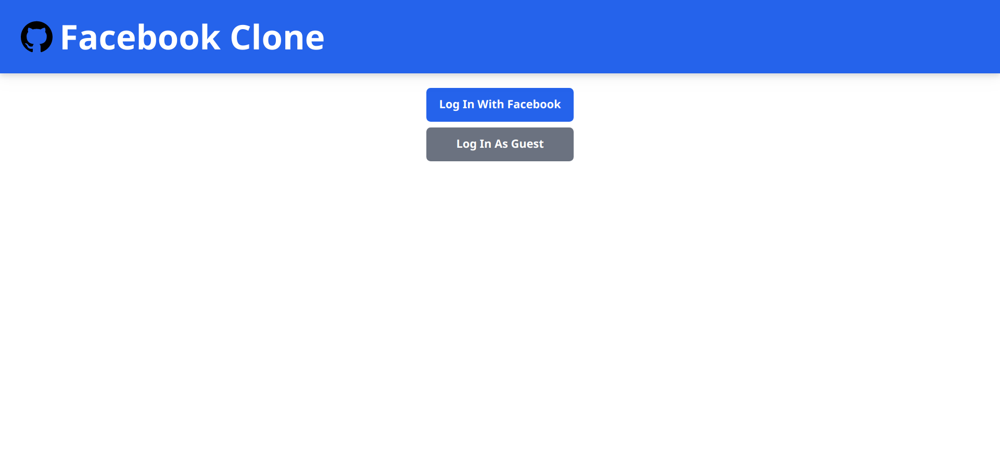
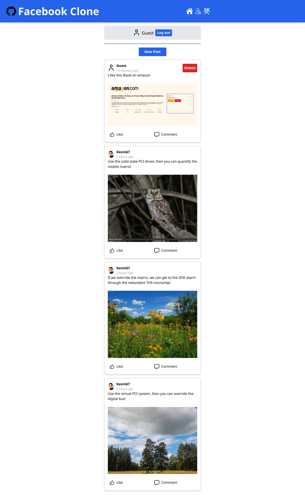
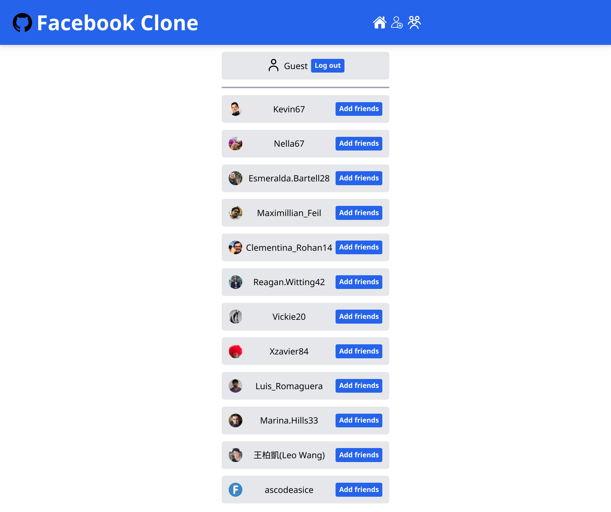
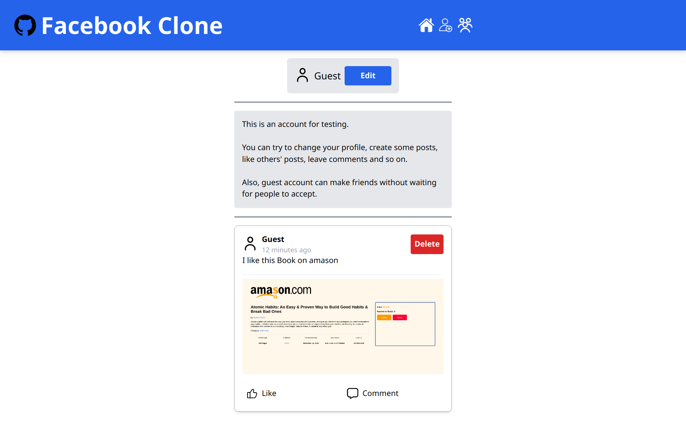

# facebook-clone-backend
A clone of facebook, idea from The Odin Project tutorial.
# Details
- Use pug template, tailwind.css for frontend
- Use Express.js and MongoDB for backend
- Use Passport.js for authentication(facebook, guest login)
- Use multer for uploading images to DB
- Use faker module to generate fake users and posts
# Results
## Login

## Post feed

## User List

## User detail

## Live Preview
[Link](https://facebook-clone-ascodeasice.up.railway.app/)